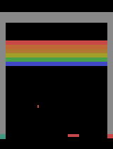
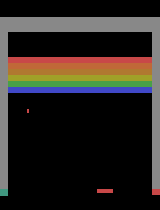
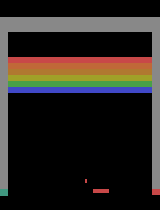
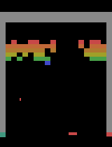
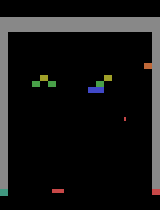
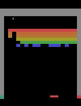

<p align="center">
  
  <br />
  <strong>🎮 Train on recordings, play the predictions 🧠</strong>
</p>

<p align="center">
  <a href="https://github.com/tsilva/gymemu/blob/main/pyproject.toml"></a>
  <a href="https://github.com/tsilva/gymemu/blob/main/LICENSE"></a>
</p>

Gymemu is a Python toolkit for comparing learned game emulators. Train different models
or multi-stage pipelines on recorded game frames and actions, then play their predictions.
Hydra config files control the game, models, training stages, and experiment settings.

The default approach is the original direct RGB CNN. An experimental latent approach
first trains a frame autoencoder, freezes it, then trains a separate latent predictor.
Both use the same dataset adapter, player, and held-out RGB evaluation metric.

`recipe=breakout_ball` adds frame-aligned `ball_x_normalized` and
`ball_y_normalized` history and predicts the next coordinates alongside RGB. Its
coordinate loss trains the shared encoder, and predicted coordinates condition the
image decoder. See [the ball-coordinate recipe](docs/recipes.md#ball-coordinate-experiment).

## Install

Install [uv](https://docs.astral.sh/uv/), then run:

```bash
git clone https://github.com/tsilva/gymemu.git
cd gymemu
uv sync --frozen
```

The locked environment uses Python 3.13. Python 3.11 through 3.13 is supported.

Training uses W&B and R2 by default. Run `uv run wandb login` and configure the
[R2 credentials](docs/training.md#r2-checkpoint-storage) before starting a run.
For local-only training, pass `wandb.mode=disabled r2.enabled=false`.

## Train and play

From the repository root:

```bash
# Default direct CNN on Breakout
uv run python train.py output=runs/breakout-direct

# Frame autoencoder, then a separate latent prediction model
uv run python train.py approach=latent output=runs/breakout-latent

# Play either approach using its checkpoint
uv run python play.py runs/breakout-direct/best.pt
```

Use a new output directory for each run. Omit `output` for a timestamped directory
under `runs/`. Training downloads the pinned
[Breakout dataset](https://huggingface.co/datasets/tsilva/gradlab-breakout-trajectories)
and writes a recorded `start-scene.npz` beside the checkpoints.

On Apple Silicon, `play.py` can use MPS, including existing ball-position checkpoints.
Pass `--device mps` to select it explicitly, or `--device cpu` for CPU playback.

Training logs to Weights & Biases by default. Authenticate once before training:

```bash
uv run wandb login
uv run python train.py output=runs/breakout-tracked
```

Projects use `gymemu-<canonical-env-id>`, so Breakout logs to
`gymemu-Breakout-Atari2600-v0`. Each run records stage losses, held-out RGB MSE,
throughput, learning rates, curriculum values, configuration, and the final summary.
Use `wandb.mode=offline` to collect logs locally or `wandb.mode=disabled` to turn tracking off.
See [tracking options](docs/training.md#weights--biases) for teams and custom environments.

Checkpoints also upload to the separate `gymemu` R2 bucket, together with the
recorded start scene, metrics, and reproduction files. Each run has a unique prefix;
immutable objects and manifests retain successfully uploaded checkpoint versions.
Use `r2.enabled=false` to keep artifacts local. Retry interrupted uploads with
`uv run python upload_checkpoints.py runs/my-run`.

The player opens that scene immediately. Every fresh action key press predicts one
next frame. Holding a key does not advance the model; R restores the scene and Escape
quits. Breakout uses Left, Right, and Space. Other games use checkpoint key bindings,
or numbered keys for their action vocabulary. The player prints its bindings.

Use `--start-scene path/to/scene.npz` to select another scene, `--key-action left=10`
to set a binding, or `--empty-start` to test learned initialization. In empty-start
mode the first press generates the initial frame without executing a game action.
A missing recorded scene produces an error instead of silently switching modes.

For repeatable debugging, select a named frame/action snapshot:

```bash
uv run python play.py runs/breakout-direct/best.pt --list-start-states
uv run python play.py runs/breakout-direct/best.pt --start-state ball-up
```

Available Breakout starts are shown below. Each image is the last recorded frame of
its eight-frame snapshot. Use the name with `--start-state`.

| `ball-up` | `near-bricks` | `paddle-approach` |
| :---: | :---: | :---: |
|  |  |  |
| Moving up after a paddle bounce | Approaching the brick wall | Descending toward paddle contact |

| `half-cleared` | `almost-cleared` | `above-bricks` |
| :---: | :---: | :---: |
|  |  |  |
| 50 bricks remain | Eight bricks remain | Ball above the wall; 86 bricks remain |

R restores the selected snapshot. These starts are shared across compatible
checkpoints so you can compare the same situation. See [the snapshot library](start_states/README.md)
for provenance and how to save more states with `save_start_state.py`.

## Saved recipes

For Docker image publishing, Beast-3 scheduling, and Runpod setup, see
[container training](containers/train/README.md).

The successful ten-epoch Breakout CNN run is saved as `recipe=breakout_cnn`.
`recipe=breakout_actions` adds seven previous executed actions alongside the current
action and eight RGB frames, using the same dataset, training budget, and MSE objective.
Generic `recipe=direct` and `recipe=latent` presets cover the original approaches.
`recipe=breakout_ball_region` keeps the action-history model and recorded training
histories, adding a separately normalized RGB loss around a detected target ball.
It uses a four-pixel margin and weight `0.3`, and logs detection coverage. See the
[ball-region experiment](docs/recipes.md#ball-region-loss-experiment) for the control
run, tuning, and detector limitations.
`recipe=breakout_scheduled` tests recovery from generated context using the action-history
CNN. It starts with two epochs of recorded context, then increases prediction feedback
to 80% by epoch 8. The [recipe guide](docs/recipes.md#scheduled-frame-feedback) explains
the sampling, compute cost, and tuning controls.

`recipe=breakout_scheduled_fast` accelerates the same curriculum with factored action
inputs, bfloat16 feedback buffers, and selective prediction at low feedback rates.
See the [matched Beast-3 benchmarks](docs/performance.md#scheduled-feedback-optimization)
for measured gains and reproduction commands. Existing recipes remain available as controls.

```bash
# Inspect a recipe without downloading data or starting training
uv run python train.py recipe=breakout_cnn --cfg job --resolve

# Train on a CUDA host after building the frame cache described below
uv run python train.py recipe=breakout_cnn output=runs/breakout-recipe

# Try the action-history variant with the same cache
uv run python train.py recipe=breakout_actions output=runs/breakout-actions

# Replay the settings captured by a previous run
uv run python train.py --recipe runs/breakout-recipe/recipe.yaml output=runs/replay
```

Every new run saves a standalone `recipe.yaml`, a source archive, and a code/environment
receipt. Saved recipes pin the actual dataset revision or content fingerprint and preserve
internal tuning links, such as model dimensions and stage learning rates. See the
[recipe guide](docs/recipes.md) for inheritance, cache setup, overrides, and reproduction limits.

## Configure and compare

Configs compose in layers: `game`, `model`, `approach`, `trainer`, `optimizer`, then
optional `recipe` and `experiment` presets. Command-line overrides take precedence.

```bash
# Inspect the complete configuration without loading data
uv run python train.py approach=latent --cfg job --resolve

# Inherit a smaller CNN config and override training settings
uv run python train.py model=direct_small history=4 trainer.epochs=5

# Reuse CUDA settings for either approach
uv run python train.py approach=latent experiment=cuda

# Tune one stage independently
uv run python train.py approach=latent approach.stages.0.epochs=5 approach.stages.1.epochs=20

# Sweep architectures and seeds; Hydra creates a separate directory per run
uv run python train.py --multirun approach=direct,latent seed=47,48 hydra.sweep.dir=runs/comparison

# Rank runs with matching evaluation targets and export their budgets and metrics
uv run python compare.py runs/comparison --csv logs/comparison.csv
```

The latent approach's `model` group configures its codec. Set
`approach.models.dynamics.width=128` to tune its predictor. See the
[training guide](docs/training.md) for config inheritance and artifacts, and
[approach guide](docs/approaches.md) for adding models or pipelines.

## Faster CUDA training

For large datasets, build a lossless frame cache once and reuse it across runs.
The cache preserves every RGB pixel and verifies source and cache checksums.
Use the same immutable dataset revision for caching and training.

```bash
uv run python cache_frames.py \
  --dataset tsilva/gradlab-breakout-trajectories \
  --revision 676ff6388f4218d3c3a3ce9f2f33e075fa7314a3 \
  --output data/breakout-676ff638-lz4

uv run python train.py experiment=cuda_cached \
  game.revision=676ff6388f4218d3c3a3ce9f2f33e075fa7314a3 \
  trainer.frame_cache=data/breakout-676ff638-lz4 trainer.epochs=10 \
  output=runs/breakout-cached
```

This preset uses two loading threads, compiled computation, and overlapping CUDA
transfers. It retains the direct CNN, full RGB frames, eight-frame history, and pixel
MSE. Compilation adds startup time; checkpoints also load on CPUs without compilation
or a frame cache. See [performance measurements](docs/performance.md) for results,
reproduction commands, and the synchronization tradeoff.

## Other games

The training path is game-independent. Supply a dataset with the supported RGB-frame,
episode, and scalar integer action schema:

```bash
uv run python train.py game=custom game.name=my-game game.dataset=/absolute/path/to/snapshot
```

Hub IDs work too. Add a YAML file under `configs/game/` to save a dataset ID, immutable
revision, splits, key bindings, and recorded start selection. Images retain their
original dimensions and colors. Other dataset layouts, continuous actions, and compound
actions require an adapter; a dataset name alone does not establish compatibility.

## Checks

```bash
uv run pytest
uv run ruff check .

# Bounded training; still downloads the dataset snapshot
uv run python train.py experiment=smoke wandb.mode=disabled r2.enabled=false output=runs/smoke
uv run python play.py runs/smoke/best.pt --device cpu --headless-actions 0,1,2 --output logs/smoke.png
```

Open `logs/smoke.png` to inspect the result. A smoke checks the pipeline; its training
budget does not produce a playable model. Add `approach=latent` to exercise both stages.

## Notes

- Every run saves resolved config, dataset provenance, stage metrics, all inference
  weights, and a comparison summary. Checkpoints support playback, not optimizer resume.
  Existing version-1 direct CNN checkpoints still load.
- Representation fitting and prediction fitting use training episodes only. All
  approaches are evaluated in float32 using held-out next-frame RGB MSE. The comparison
  command separates different datasets and target sets, and reports training budgets.
- Playback feeds predictions back into the model, so errors can accumulate even with
  low evaluation MSE. Check ball motion, collisions, and brick persistence in rollouts.
- Eight history frames are a practical baseline, not a guarantee of full observability.
  See the [history investigation](docs/history.md). Empty-history initialization can
  average distinct recorded reset states.

## Architecture

The image shows the direct baseline. Alternative approaches replace its model and
training stages while sharing data alignment, checkpoint loading, and playback.
Game thumbnails illustrate the flow; they are not measured outputs.


## License

[MIT](LICENSE)
