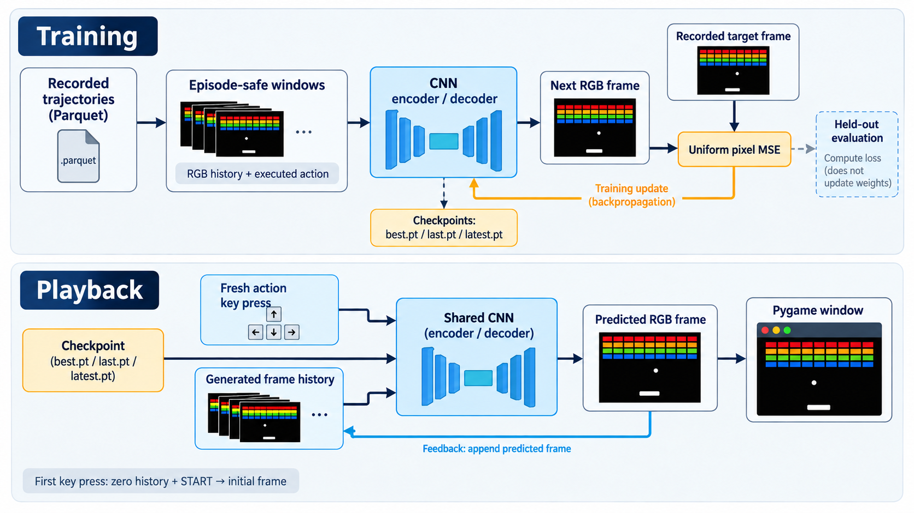

<div align="center">
  

  **Spatial latent world-model training and playback for Gymnasium retro recordings.**
</div>

gymemu trains and runs a learned emulator for retro Gymnasium recordings. The current
codebase is centered on one path: a spatial latent world model that predicts the next
Breakout frame from a short frame history plus a one-hot action.

Training and runtime share the same preprocessing: crop the scoreboard, reject invalid
backgrounds, resize frames to 80x96, binarize the playfield, and encode Breakout actions
as `NOOP`, `FIRE`, `RIGHT`, and `LEFT`.

## Install

```bash
git clone git@github.com:tsilva/gymemu.git
cd gymemu
uv sync --frozen --all-extras --no-config
```

Run the emulator from the repo root:

```bash
uv run python main.py \
  --dataset tsilva/gymrec__BreakoutNoFrameskip_dash_v4 \
  --game breakout \
  --history-length 4
```

This opens a Pygame window. Use `Space` for `FIRE`, the arrow keys for horizontal
movement, and `Escape` to quit.

## Commands

```bash
# Build a prepared rollout dataset.
uv run python scripts/build_training_dataset.py \
  --source-dataset tsilva/gymrec__BreakoutNoFrameskip_dash_v4 \
  --target-dataset tsilva/gymrec__BreakoutNoFrameskip_dash_v4_stack4_unroll16_train_ready \
  --history-length 4 \
  --unroll-steps 16

# Train locally from a prepared dataset.
uv run python train.py \
  --dataset tsilva/gymrec__BreakoutNoFrameskip_dash_v4_stack4_unroll16_train_ready \
  --game breakout \
  --history-length 4 \
  --unroll-steps 16

# Run from a local checkpoint directory.
uv run python main.py \
  --dataset tsilva/gymrec__BreakoutNoFrameskip_dash_v4 \
  --game breakout \
  --history-length 4 \
  --use-local-models \
  --models-dir ./models

# Render dataset inspection images and GIFs.
uv run python scripts/inspect_dataset.py \
  --dataset tsilva/gymrec__BreakoutNoFrameskip_dash_v4_stack4_deduped \
  --source-dataset tsilva/gymrec__BreakoutNoFrameskip_dash_v4 \
  --emit-gifs

# Launch remote CUDA training on Modal.
modal run modal_train.py --epochs 50 --batch-size 16

# Verify the locked environment.
uv lock --check --no-config
uv audit --locked --no-config
uv run ruff check .
uv run ruff format --check .
uv run pytest -q
```

## Notes

- `train.py` expects a prepared rollout dataset with `train` and `validation` splits.
  Build one with `scripts/build_training_dataset.py`.
- Checkpoints are written to `./models/<dataset-name>-spatial-dynamics.pt`.
- `main.py` loads local checkpoints with `--use-local-models`, an exact checkpoint with
  `--spatial-dynamics-path`, or Hugging Face model artifacts when local loading is off.
- `.env` is optional. Use `HF_TOKEN` for private Hugging Face access and `WANDB_MODE`,
  `WANDB_PROJECT`, `WANDB_ENTITY`, `WANDB_API_KEY`, `WANDB_RUN_NAME`, `WANDB_TAGS`, and
  `WANDB_NOTES` for Weights & Biases logging.
- `scripts/build_training_dataset.py` uploads to Hugging Face unless `--skip-upload` is
  passed.
- Modal training requires `pip install modal` and `modal setup` before `modal run`.
- CUDA is the fast path; Apple Silicon uses `mps` when available. `torch.compile()` is
  only enabled on CUDA.
- Runtime modes are `realtime` at 30 FPS and `on-action`, which advances one model step
  only when an action key is pressed.
- The legacy latent-delta and direct pixel-model paths have been removed.

## Architecture



## License

[MIT](LICENSE)
